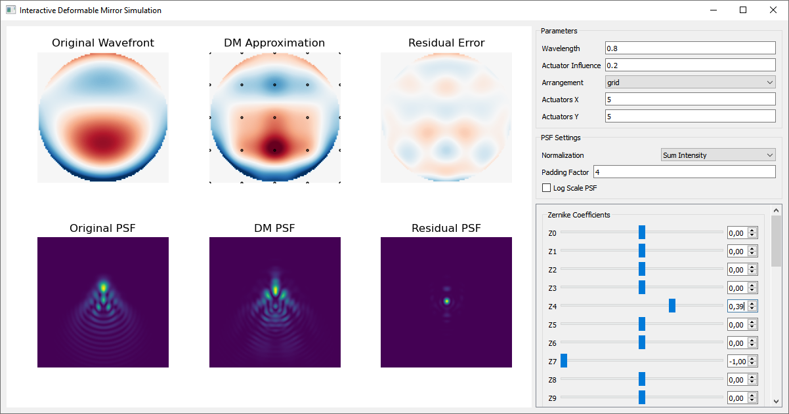

# Deformable Mirror-Simulation
This script simulates a dynamically changing wavefront and its correction by a deformable mirror. It allows choosing actuator arrangements (e.g., grid or circular) and visually compares the original, corrected, and residual wavefronts, along with their corresponding PSFs.

# Interactive Deformable Mirror Simulation
